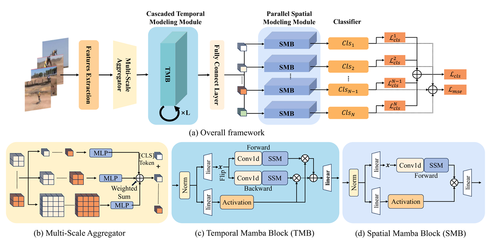

# VSumMamba: Mamba Empowered Efficient Video Summarization with Multi-Scale Spatial-Temporal Modeling
The [paper](https://dl.acm.org/doi/10.1145/3746027.3755644) is published in ACM MM 2025.
## Overview


## Abstract
The exponential growth of video content necessitates efficient summarization techniques that balance local redundancy reduction and global dependency modeling. In this work, we introduce VSumMamba, an innovative video summarization approach that leverages Selective State Space Models to address the quadratic complexity limitations of Transformer based approaches meanwhile surpassing CNNs’ restricted long-range modeling capabilities. The proposed framework comprises three core components: 1) a Multi Scale Aggregator, 2) a Cascaded Temporal Modeling Module with bi-directional Mamba blocks for temporal representation enhancement, and 3) a Parallel Spatial Modeling Module employing spatial Mamba blocks, operating in concert to effectively refine spatiotemporal video representations. Through three specialized multi-scale spatial-temporal modeling schemes, VSumMamba demonstrate the ability to balance computational efficiency and summarization performance. Comprehensive evaluations on benchmarks datasets
demonstrate VSumMamba’s superior performance, achieving 67.5% and 56.0% F1-scores on TVSum and SumMe respectively, while
maintaining lower computational cost compared to existing state of-the-art methods.

## Environment
```
pip install causal-conv1d
pip install mamba-ssm
```

## Citation
```
@inproceedings{ding2025VSumMamba,
title={VSumMamba: Mamba Empowered Efficient Video Summarization with Multi-Scale Spatial-Temporal Modeling},
author={Ding, Yamiao and Liu, Tianrui and Lu, Zhizhou and Huang, Jun-Jie and Zhao, Wentao and Liu, Xinwang and Wang, Meng},
booktitle={33rd ACM International Conference on Multimedia, MM 2025},
year={2025},
}
```
# Acknowledgments
Our code is based on [STVT](https://github.com/nchucvml/STVT), [Vim](https://github.com/doodleima/vision_mamba) and [VideoMamba](https://github.com/OpenGVLab/VideoMamba).


